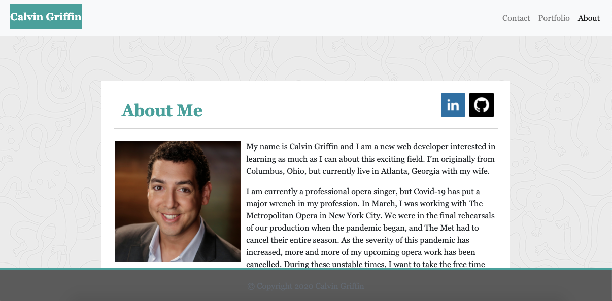
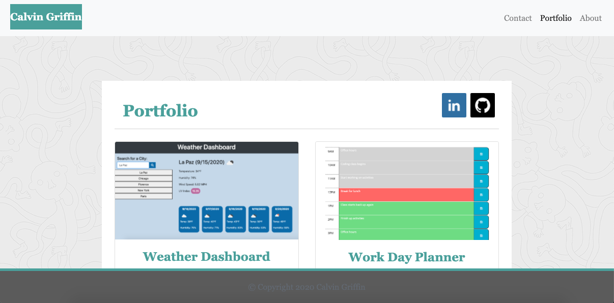
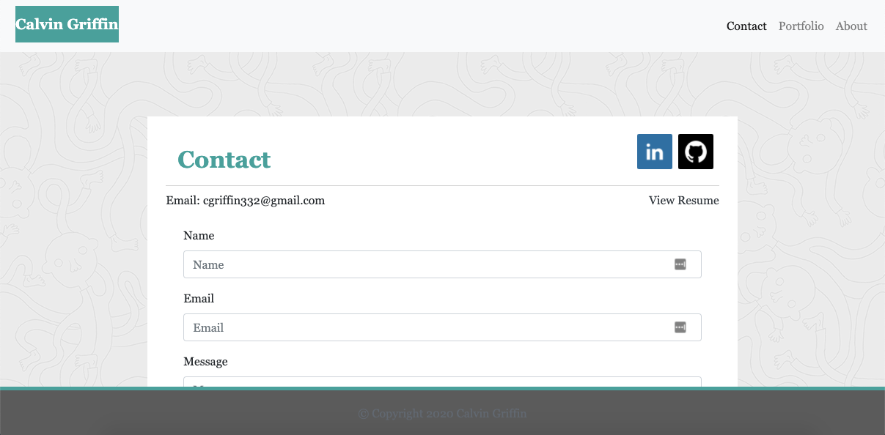
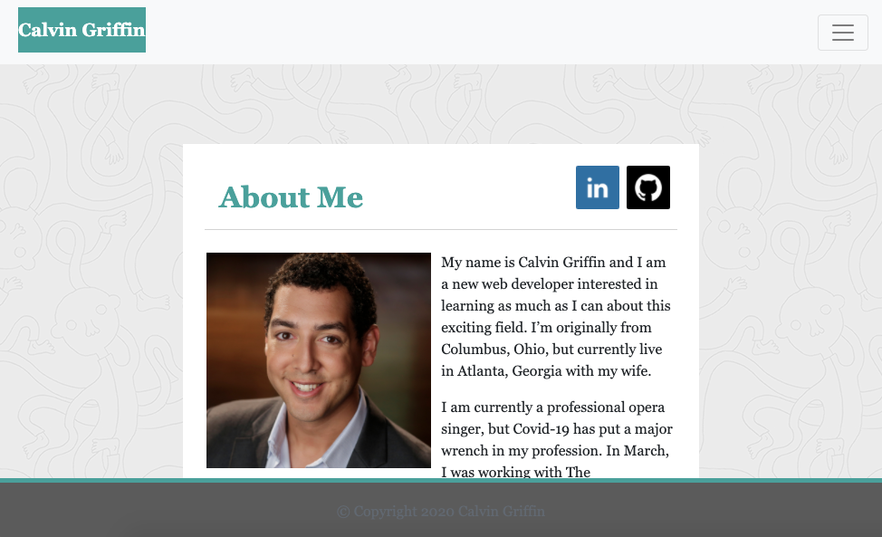
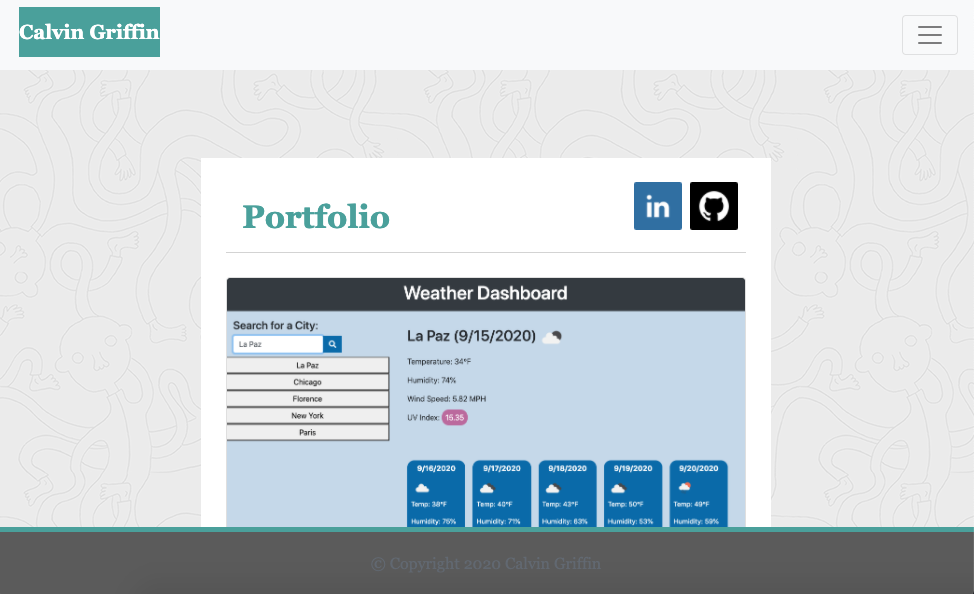
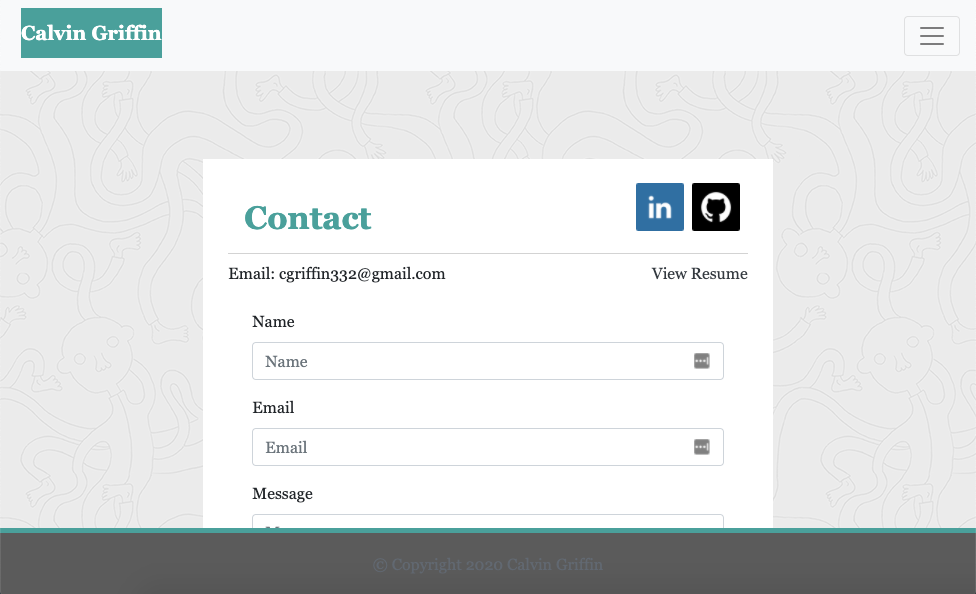
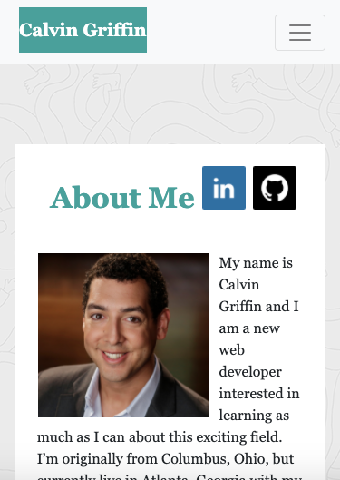
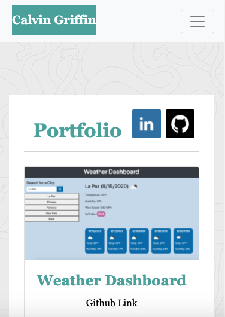
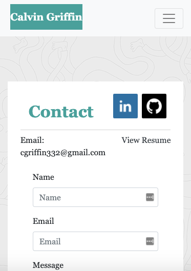

# Portfolio-React

## Description 

In this project I have created a responsive design portfolio using HTML, CSS, Bootstrap, and React. The main focus was for the site to be responsive across all browser widths, and for it to display my projects and contact information. 

## Table of Contents 

* [Installation](#installation)
* [Usage](#usage)
* [License](#license)

## Installation

Click on this link:
http://cgriffin332.github.io/portfolio-react/

## Usage 

This is to be used as a means in which to present my bio, portfolio, and contact form in a website responsive to any browser width.

The following are screenshots of website pages on a large browser width:

The following are screenshots of website pages on a medium browser width:

The following are screenshots of website pages on a small browser width:

## Contact
Calvin Griffin  
Email: cgriffin332@gmail.com  
LinkedIn: https://www.linkedin.com/in/calvin-griffin-8247521b7/  
Portfolio: https://cgriffin332.github.io/Updated-Portfolio332/

## License

MIT License

Copyright (c) [2020] [Calvin Griffin]

Permission is hereby granted, free of charge, to any person obtaining a copy
of this software and associated documentation files (the "Software"), to deal
in the Software without restriction, including without limitation the rights
to use, copy, modify, merge, publish, distribute, sublicense, and/or sell
copies of the Software, and to permit persons to whom the Software is
furnished to do so, subject to the following conditions:

The above copyright notice and this permission notice shall be included in all
copies or substantial portions of the Software.

THE SOFTWARE IS PROVIDED "AS IS", WITHOUT WARRANTY OF ANY KIND, EXPRESS OR
IMPLIED, INCLUDING BUT NOT LIMITED TO THE WARRANTIES OF MERCHANTABILITY,
FITNESS FOR A PARTICULAR PURPOSE AND NONINFRINGEMENT. IN NO EVENT SHALL THE
AUTHORS OR COPYRIGHT HOLDERS BE LIABLE FOR ANY CLAIM, DAMAGES OR OTHER
LIABILITY, WHETHER IN AN ACTION OF CONTRACT, TORT OR OTHERWISE, ARISING FROM,
OUT OF OR IN CONNECTION WITH THE SOFTWARE OR THE USE OR OTHER DEALINGS IN THE
SOFTWARE.

---